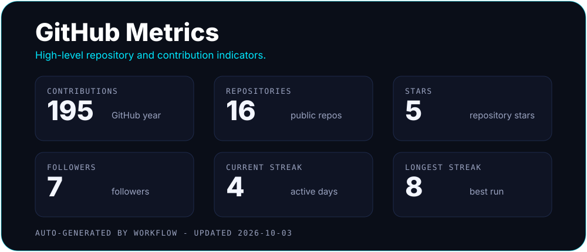
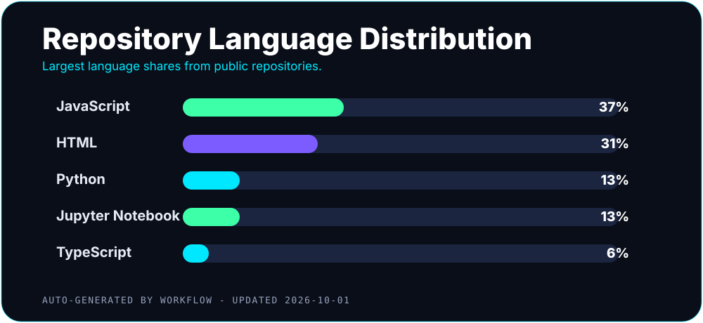
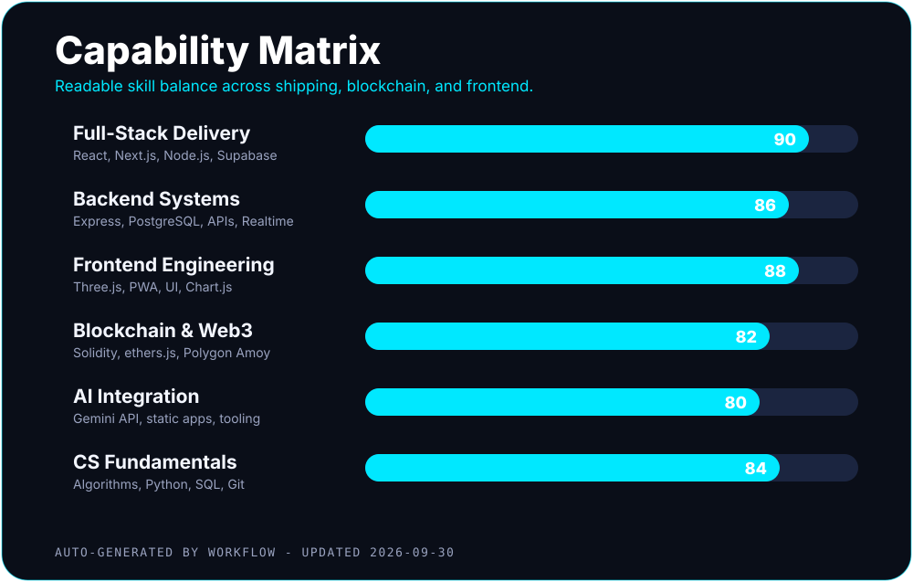
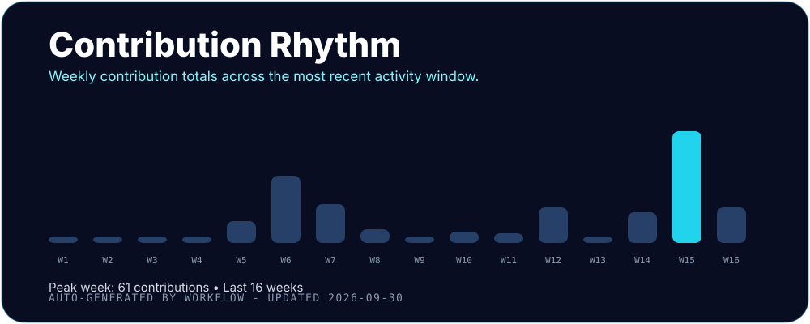

<div align="center">

[](https://git.io/typing-svg)

[](mailto:shaninmahmood@gmail.com)
[](https://tanveer-shanin.vercel.app/)
[](https://www.linkedin.com/in/md-tanveer-mahmood-shanin-67a96629b/)


</div>

### 📁 shanin.dev/

```sh
$ whoami
MD Tanveer Mahmood Shanin — Full-Stack Developer, UITS CSE '26
$ stack --list
React · Node.js · TypeScript · Solidity · Polygon · Supabase
$ status
open to work — Dhaka, BD / Remote · Sat–Thu 10AM–8PM GMT+6
```

## ├─about.md

I don't just plan software — I ship it. Live, deployed, working software, not slide decks. Backend, frontend, database, deployment — the whole thing myself.

<table>
  <tr>
    <td align="center" width="33%">
      <h3>Full-Stack Shipper</h3>
      Petition Hub, Skip Clearance, Connectors, KeyForge — Next.js + Supabase + PWA. 8 live projects.
    </td>
    <td align="center" width="33%">
      <h3>Blockchain Builder</h3>
      Product provenance tracker on Polygon Amoy, decentralized voting capstone, ethers.js + MetaMask flows.
    </td>
    <td align="center" width="33%">
      <h3>Playful Engineer</h3>
      Kabaddi: Raid Master 3D + mic chant, Yutnori realtime multiplayer, Sarangsho AI summarizer.
    </td>
  </tr>
</table>

## ├─career.build

<table>
  <tr>
    <td width="50%" valign="top">
      <h3>Now</h3>
      B.Sc. CSE (UITS) done, Team Lead — KAIST WFK IT Training, Excellence Award. Building petition-hub, kabaddi-raid-master, provenance-tracker.
      <br><br>
      WICE Bronze — Find Blood project. 13 certificates.
    </td>
    <td width="50%" valign="top">
      <h3>Looking For</h3>
      Full-stack roles (on-site / hybrid / remote) — React + Node + TypeScript.
      <br><br>
      Best fit: teams who ship fast, review honestly, and care about real users — not slide decks.
    </td>
  </tr>
</table>

## ├─github.sh — live from portfolio theme

<div align="center">


</div>





